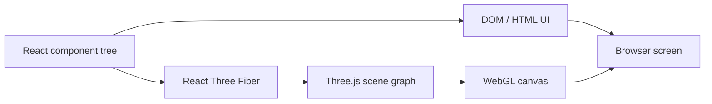
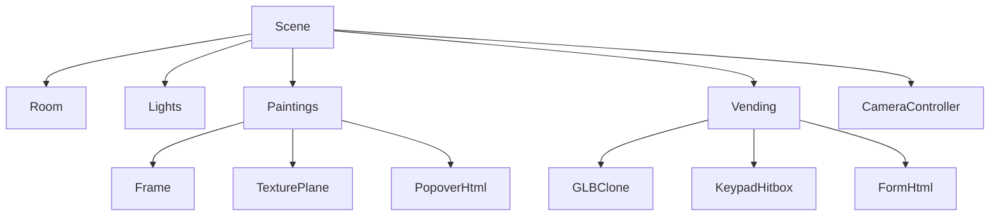
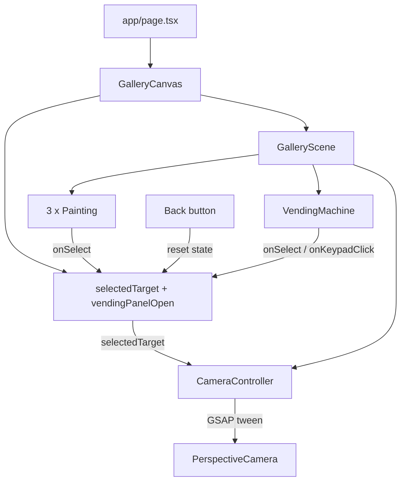
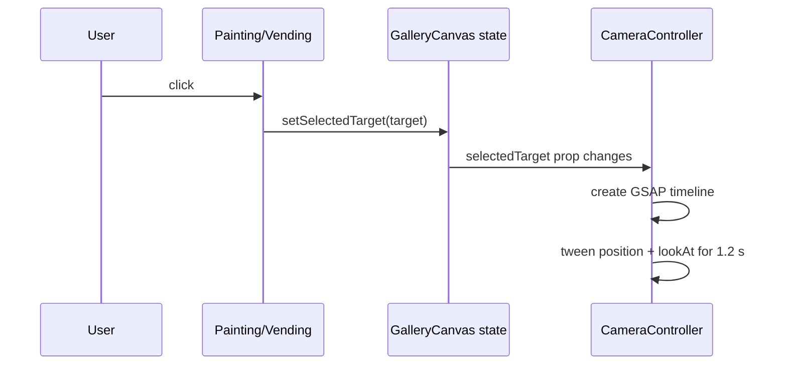
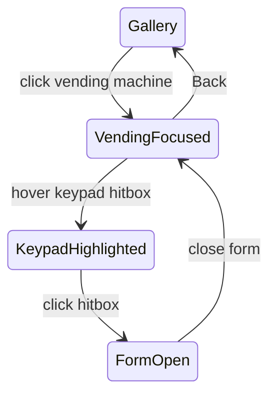
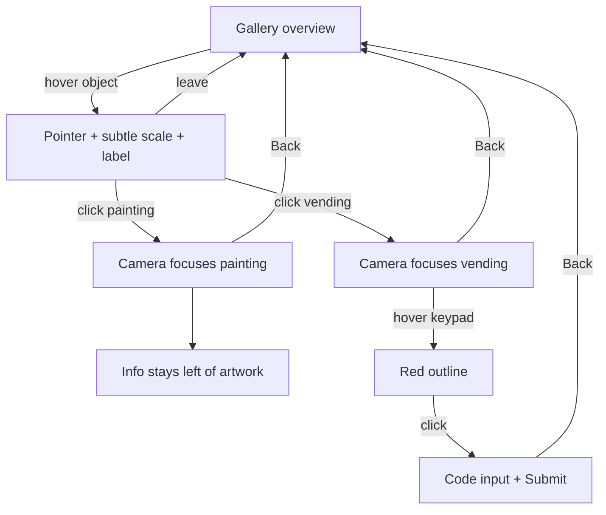

# Building an Interactive 3D Art Gallery

A step-by-step guide - Next.js, TypeScript, React Three Fiber, Drei, Three.js, and GSAP

Documentation version: 1.0  
Project snapshot: gallery implementation as of September 8, 2026

---

## 1. Learning goals

This document explains the actual `interactive-gallery` project rather than an isolated demo. After reading it, you should understand:

- the difference between the regular React DOM and a Three.js scene graph;
- the roles of a scene, camera, renderer, geometry, material, mesh, texture, and light;
- how React Three Fiber translates JSX into Three.js objects;
- how to construct a 3D room with a coordinate system;
- how to create a reusable, data-driven Painting component;
- how selection, hover, pointer events, and HTML overlays work;
- how to animate a camera with GSAP;
- how to load a GLB model and add an invisible hitbox;
- why z-fighting, misplaced hitboxes, and common 3D UI issues occur;
- how to extend the project safely.

> Note: positions and sizes use Three.js world units. This project treats one unit approximately as one meter for easier reasoning, although Three.js does not enforce a physical unit.

## 2. Stack and responsibilities

| Technology | Responsibility in this project |
|---|---|
| Next.js App Router | Application shell, metadata, routing, bundling, and public asset serving |
| React + TypeScript | Component composition, UI state, props, and type checking |
| Three.js | 3D engine: vectors, cameras, meshes, materials, lights, textures, and scene graph |
| React Three Fiber (R3F) | React renderer for Three.js; allows scenes to be written in JSX |
| Drei | R3F helpers such as `Html`, `useTexture`, `useGLTF`, `Clone`, and `Edges` |
| GSAP | Cinematic tweening of the camera position and look-at target |
| CSS | DOM UI: Back button, popovers, vending form, and visual accessibility |

Important versions at the time of writing:

```text
Next.js              16.3.4
React                19.2.8
Three.js             0.185.1
@react-three/fiber   9.7.0
@react-three/drei    10.7.8
GSAP                 3.15.0
```

## 3. Running the project

```bash
cd interactive-gallery
yarn install
yarn dev
```

Open `http://localhost:3000`. For static validation:

```bash
yarn lint
yarn tsc --noEmit
```

If `tsc` is not defined as a package script, invoke `yarn tsc --noEmit` directly as shown above.

## 4. Project structure

```text
interactive-gallery/
├── app/
│   ├── page.tsx                 # route entry
│   ├── layout.tsx               # root HTML and metadata
│   └── globals.css              # full-screen layout and DOM UI
├── components/gallery/
│   ├── GalleryCanvas.tsx        # client boundary, Canvas, primary state
│   ├── GalleryScene.tsx         # room, lights, object data, scene composition
│   ├── Painting.tsx             # reusable painting and popovers
│   ├── CameraController.tsx     # GSAP camera animation
│   └── VendingMachine.tsx       # GLB, hover, hitbox, and form
├── public/
│   ├── paintings/               # JPG painting textures
│   └── model/                   # soda_vending_machine.glb
├── docs/                        # Markdown documentation sources
└── output/pdf/                  # final PDF documentation
```

The modularity rule is simple: the page does not know Three.js details, the Canvas does not construct the room, the scene does not own tween logic, and every interactive object manages its local behavior.

## 5. Mental model: DOM and the 3D world

The application has two visual layers:



- The Back button and model credit are regular DOM elements above the canvas.
- Walls, lights, paintings, camera, and vending machine are objects in the 3D scene.
- Drei's `<Html>` bridges both worlds: its position follows a 3D point, but its children are DOM elements, so inputs and buttons remain practical.

The scene graph is hierarchical:



A parent transform affects all children. If a `<group>` rotates, the local positions of its meshes and hitboxes rotate with it. This is crucial when placing paintings on side walls and calibrating the keypad hitbox.

## 6. 3D coordinate fundamentals

Three.js uses a right-handed coordinate system:

```text
             +Y (up)
              |
              |
              o------ +X (right)
             /
            /
          +Z (toward the initial camera)

The back wall sits on negative Z.
The initial camera sits on positive Z and looks toward negative Z.
```

The `[x, y, z]` tuple is used for `position`, while `rotation` uses radians in `[x, y, z]` order.

```tsx
position={[0, 2.45, -4.86]}
rotation={[0, Math.PI / 2, 0]}
```

- `Math.PI / 2` is 90 degrees.
- `-Math.PI / 2` is -90 degrees.
- A child position is local to its parent.
- After the parent rotates, a child's local axes do not necessarily match world axes.

## 7. Application architecture



Selection has one source of truth in `GalleryCanvas`. Paintings and the vending machine do not move the camera directly. They only report the selected target, and `CameraController` reacts to that state change.

## 8. Step 1 - App Router shell

### `app/layout.tsx`

This file creates the root HTML document, imports global CSS, and defines metadata.

```tsx
export const metadata: Metadata = {
  title: "Ruang Imaji | Galeri 3D",
  description: "Pengalaman galeri lukisan 3D interaktif.",
};
```

`<html lang="id">` tells browsers and screen readers the primary interface language. `children` is the active route inserted by Next.js.

### `app/page.tsx`

```tsx
export default function Home() {
  return (
    <main className="gallery-page" aria-label="Galeri seni virtual">
      <GalleryCanvas />
    </main>
  );
}
```

The page remains deliberately small. It provides a semantic `<main>` landmark and delegates the complete 3D implementation to the gallery component.

## 9. Step 2 - Client boundary and Canvas

`GalleryCanvas.tsx` starts with:

```tsx
"use client";
```

This is required because the component uses React state, browser events, and WebGL. Server Components cannot use those APIs directly.

Canvas configuration:

```tsx
<Canvas
  camera={{ position: [0, 2.4, 6.5], fov: 58, near: 0.1, far: 50 }}
  dpr={[1, 1.75]}
  frameloop="demand"
  gl={{ antialias: true, powerPreference: "high-performance" }}
  shadows="percentage"
>
```

Each option means:

- `position`: initial PerspectiveCamera location.
- `fov`: vertical field of view; lower values feel zoomed in, higher values feel wide-angle.
- `near` and `far`: camera clipping range. Objects outside it are not drawn.
- `dpr={[1, 1.75]}`: caps pixel ratio so retina displays do not become excessively expensive.
- `frameloop="demand"`: renders only after a change, saving GPU work in a mostly static scene.
- `antialias`: smooths geometry edges.
- `powerPreference`: asks for a high-performance GPU when available.
- `shadows="percentage"`: a shadow mode compatible with the current Three.js version.

`<Suspense fallback={null}>` waits for textures and the GLB before rendering an incomplete scene.

## 10. Step 3 - Selection state

The central state is:

```tsx
const [selectedTarget, setSelectedTarget] =
  useState<GalleryFocusTarget | null>(null);
const [vendingPanelOpen, setVendingPanelOpen] = useState(false);
```

`null` means the camera is in gallery overview. A target follows this contract:

```tsx
type GalleryFocusTarget = {
  id: string;
  title: string;
  position: readonly [number, number, number];
  cameraTarget: readonly [number, number, number];
};
```

`position` is the point the camera looks at. `cameraTarget` is the destination of the camera itself, not its look direction. A future refactor could rename it to `cameraPosition` for clarity.

The Back button is conditionally rendered whenever a selection exists. `handleBack()` resets both selection and the vending panel, so CameraController automatically returns home.

## 11. Step 4 - Constructing the room

Room dimensions live in one constant:

```tsx
const ROOM = {
  width: 12,
  height: 6,
  depth: 10,
  wallThickness: 0.2,
} as const;
```

Every surface is a geometry/material pair:

```tsx
<mesh receiveShadow position={[0, -0.1, 0]}>
  <boxGeometry args={[ROOM.width, ROOM.wallThickness, ROOM.depth]} />
  <meshStandardMaterial color="#302a24" roughness={0.8} />
</mesh>
```

In Three.js:

```text
Mesh = Geometry + Material + Transform
```

- Geometry defines shape.
- Material defines how the surface responds to light.
- Transform is position, rotation, and scale.
- `receiveShadow` lets the surface receive shadows.

The floor is slightly below `y=0`. The back wall is at `z=-depth/2`. Side walls are at `x=±width/2`.

## 12. Step 5 - Lighting

The scene uses one ambient light and four spotlights.

```tsx
<ambientLight color="#fff4df" intensity={0.42} />
```

Ambient light supplies a uniform baseline so shadows do not become completely black. Spotlights provide direction, focus, and the gallery mood.

A Three.js spotlight requires an `Object3D` target rather than a tuple:

```tsx
const targetObject = useMemo(() => {
  const object = new Object3D();
  object.position.set(...target);
  return object;
}, [target]);
```

`useMemo` keeps the target identity stable across renders. `<primitive object={targetObject} />` inserts a raw Three.js object into the R3F scene graph.

Important spotlight properties:

- `intensity`: light strength;
- `distance`: maximum range;
- `angle`: cone width in radians;
- `penumbra`: cone edge softness;
- `decay`: energy falloff over distance;
- `shadow-mapSize`: shadow texture resolution;
- `shadow-bias` and `shadow-normalBias`: reduce shadow acne.

## 13. Step 6 - Data-driven paintings

Instead of writing three separate components, all artwork metadata lives in the `paintings` array.

```tsx
type GalleryPainting = GalleryFocusTarget & {
  src: string;
  description: string;
  price: number;
  rotation: Vector3Tuple;
  size: readonly [number, number];
};
```

It is then rendered with `map`:

```tsx
{paintings.map((painting) => (
  <Painting
    key={painting.id}
    {...painting}
    selected={selectedTarget?.id === painting.id}
    onSelect={() => onSelectTarget(painting)}
  />
))}
```

Benefits of this pattern:

- adding a painting only requires another data entry;
- appearance and interaction remain consistent;
- TypeScript ensures every item is complete;
- every object owns its camera destination.

Current placement:

| Painting | Wall | Y rotation | Camera about 3 m in front |
|---|---|---:|---|
| Danau Fajar | left | `Math.PI / 2` | `[-2.86, 2.45, -2.2]` |
| Champions 1999 | back | `0` | `[0, 2.45, -1.86]` |
| Kota Bulan Sabit | right | `-Math.PI / 2` | `[2.86, 2.45, -2.2]` |

## 14. Step 7 - The Painting component

### Loading a texture

```tsx
const texture = useTexture(src);
```

`useTexture` loads the JPG into a `THREE.Texture` and integrates with Suspense. The preload calls at the bottom start loading known images early.

### Frame and image plane

The backing uses a thin box while the image uses a plane in front:

```tsx
<boxGeometry args={[width + 0.12, height + 0.12, 0.04]} />
<planeGeometry args={[width, height]} />
```

The plane sits at `z=0.035`, slightly ahead of the frame. This small separation matters. When two surfaces are almost coplanar, the depth buffer cannot consistently decide which one is in front, producing flicker called **z-fighting**.

`meshStandardMaterial` reacts to lighting. Higher `roughness` creates softer reflections. When selected, the frame receives subtle emissive color to make focus state visible.

### Smooth hover

`useFrame` executes during active render frames:

```tsx
const targetScale = hovered && !selected ? 1.035 : 1;
const nextScale = MathUtils.damp(
  artworkRef.current.scale.x,
  targetScale,
  12,
  delta,
);
```

`MathUtils.damp` makes the transition frame-rate independent. `delta` is elapsed time since the previous frame. Hover scaling is disabled after selection so the object does not zoom again when the camera is already close.

Because Canvas renders on demand, `invalidate()` is called until the scale reaches its target.

### Pointer events

```tsx
event.stopPropagation();
setHovered(active);
document.body.style.cursor = active ? "pointer" : "default";
```

R3F raycasts from the pointer into the 3D scene. `stopPropagation()` prevents the event from continuing to meshes behind the current hit.

### Popovers

There are two modes:

- not selected: appears above the painting on hover;
- selected: remains visible to the left of the painting.

`<Html>` projects a 3D anchor into DOM coordinates. `distanceFactor` controls how 3D distance affects the HTML scale. The selected popover anchors to the local left edge so the panel does not cover the artwork.

## 15. Step 8 - CameraController and GSAP

When selection changes:



Two camera values animate simultaneously:

1. `camera.position` moves toward the object's `cameraTarget`;
2. a `lookAt` vector moves toward the object center.

```tsx
timeline
  .to(camera.position, { x, y, z }, 0)
  .to(lookAt, { x, y, z }, 0);
```

The timeline position argument `0` starts both tweens at the same time. `power2.inOut` accelerates gently at the beginning and decelerates near the destination.

On every update:

```tsx
camera.lookAt(lookAt);
camera.updateProjectionMatrix();
invalidate();
```

The `timeline.kill()` cleanup prevents an old tween from continuing if the user selects another object quickly.

When selection is `null`, destination becomes `HOME_POSITION` and focus becomes `HOME_LOOK_AT`; the same mechanism returns the camera home.

## 16. Step 9 - Loading the vending machine GLB

GLB is glTF's binary container. One file can include a mesh hierarchy, PBR materials, textures, cameras, animations, and metadata.

```tsx
const { scene } = useGLTF(MODEL_PATH);
<Clone object={scene} castShadow receiveShadow />
```

Why `Clone`? A Three.js object should not be attached to more than one parent. Cloning gives a safe instance if the model is reused later.

```tsx
<group
  position={[...position]}
  rotation={[0, Math.PI + Math.PI / 5, 0]}
  scale={MODEL_SCALE}
>
```

The group is the transform root. Model, label, hitbox, and form all use the same local coordinate space. Materials and textures are embedded in the GLB, while scene lighting determines how clearly its design appears.

The current model is by RasenDan on Sketchfab and licensed under CC BY 4.0. A permanent model credit link is therefore displayed in the UI.

## 17. Step 10 - Invisible keypad hitbox

The model does not need to be split for a simple interaction. A transparent mesh can sit in front of the keypad:

```tsx
const KEYPAD_HITBOX = {
  position: [-0.35, 0.26, -0.47],
  size: [0.17, 0.27, 0.005],
} as const;
```

```tsx
<mesh position={[...KEYPAD_HITBOX.position]} onClick={handleKeypadClick}>
  <boxGeometry args={[...KEYPAD_HITBOX.size]} />
  <meshBasicMaterial
    transparent
    opacity={0}
    depthWrite={false}
    colorWrite={false}
  />
  {keypadHovered && <Edges color="#ff3b30" lineWidth={2.5} />}
</mesh>
```

Even without visible color, the geometry still participates in raycasting. `colorWrite={false}` prevents it from writing color, while `depthWrite={false}` prevents it from occluding other objects in the depth buffer.

The hitbox is only rendered after the vending machine is selected. This creates a two-stage flow:



`Edges` appears only on hover, providing an affordance for the clickable area. The click handler logs the object name, world point, and raycast UV for debugging.

### Why did the hitbox position drift?

Hitbox values live in the GLB group's local coordinates. That group is rotated and scaled, so “move left” on screen does not always mean decreasing local X. A safe debugging workflow is:

1. temporarily render the material at 0.2 opacity;
2. use a bright color and `Edges`;
3. change one axis at a time in small increments;
4. inspect from the focused camera, not only from overview;
5. restore opacity to 0 after calibration.

If every button needs a unique action, choose one of two approaches:

- create multiple small hitboxes carrying labels such as `A`, `1`, and `2`;
- name button meshes in Blender and retrieve nodes by `name` from the `useGLTF` result.

The model does not need to be split into multiple files. Well-named nodes inside one GLB are usually enough.

## 18. Step 11 - HTML form inside the scene

The vending form is rendered through Drei `<Html>`:

```tsx
<Html
  center
  position={[0, 0.13, -0.78]}
  distanceFactor={4}
  zIndexRange={[100, 0]}
  style={{ pointerEvents: "auto" }}
>
```

`pointerEvents: "auto"` matters because informational popovers use `none`, while the form must accept input. Form events are stopped so button clicks do not reach the 3D group behind it.

`handleSubmit`:

1. prevents a browser reload;
2. trims whitespace;
3. normalizes the code to uppercase;
4. displays a local success message.

The current submit behavior is a UI simulation; it does not call a backend or dispense a virtual product yet.

## 19. Step 12 - Overlay CSS

`globals.css` handles three categories:

1. reset and full-screen layout;
2. global UI such as Back and model credit;
3. elements created by Drei `<Html>`, including painting popovers and the vending form.

The main visual pattern uses a dark translucent surface:

```css
background: rgb(17 15 13 / 30%);
backdrop-filter: blur(16px);
```

The pieces have different jobs:

- background alpha makes the panel translucent;
- backdrop filter blurs the scene behind the panel;
- box shadow separates the panel from the artwork;
- `z-index` controls DOM order, not WebGL mesh order.

The `prefers-reduced-motion` media query disables animation for users who request reduced motion at operating-system level.

## 20. Complete interaction flow



## 21. File-by-file reference

### `app/page.tsx`

- Entry for route `/`.
- Provides the semantic `<main>` landmark.
- Owns no state or WebGL implementation detail.

### `app/layout.tsx`

- App Router root document.
- Imports `globals.css`.
- Defines metadata and document language.

### `app/globals.css`

- Locks the application to the full viewport.
- Styles DOM overlays.
- Provides hover/focus states and reduced motion.
- Does not define Three.js materials or geometry.

### `GalleryCanvas.tsx`

- Main client boundary.
- Creates the WebGL Canvas and initial camera.
- Owns selection and vending panel state.
- Renders Back and attribution outside the canvas.

### `GalleryScene.tsx`

- Stores room, painting, vending target, and lighting data.
- Composes all 3D objects.
- Receives callbacks instead of owning selection.
- Acts as the 3D composition root.

### `Painting.tsx`

- Loads a texture.
- Creates frame and image plane.
- Owns local hover state.
- Reports selection to the parent.
- Renders overview and focused popovers.

### `CameraController.tsx`

- Renders no geometry (`return null`).
- Watches `selectedTarget` changes.
- Animates camera position and look-at vector.
- Cleans up stale timelines.

### `VendingMachine.tsx`

- Loads and clones the GLB.
- Manages model and hitbox hover.
- Displays a simple label.
- Adds an invisible hitbox without editing the GLB.
- Renders a DOM form attached to a 3D point.

## 22. Common problems and diagnosis

### Texture is black or missing

- Use a root-relative path such as `/paintings/painting-1.jpg`.
- Confirm the file is under `public/paintings`.
- Check the Network tab for a 404.
- Ensure a light exists when using `meshStandardMaterial`.
- Temporarily try `meshBasicMaterial` to distinguish texture and lighting problems.

### Frame flickers

The common cause is z-fighting. Separate the image plane from its backing or build a real frame geometry with an opening. Avoid coplanar surfaces.

### GLB appears dark or plain

- Confirm textures are embedded or accompanying `.bin` and image files are present.
- Add a light aimed at the model.
- Check texture color space and materials.
- Do not accidentally replace the GLB materials.

### The hitbox cannot be clicked

- Confirm its geometry is slightly in front of the model surface.
- Confirm `selected` is true so the hitbox is rendered.
- Look for another object catching the ray first.
- Temporarily show opacity and `Edges` while calibrating.
- Log `event.object.name` and `event.point`.

### `<Html>` UI is clipped

- Do not anchor too close to a viewport edge.
- Use different positions for overview and focused modes.
- Adjust `distanceFactor`.
- For mission-critical UI that must always remain visible, consider a fixed DOM overlay outside Canvas.

### Dev server keeps reconnecting

- Avoid running `next build` against the same `.next` directory while `next dev` is active.
- Stop stale processes and restart `yarn dev`.
- Inspect the first compilation error in the terminal instead of only the browser reconnect message.

## 23. Performance and production quality

Already implemented:

- `frameloop="demand"` for a mostly static scene;
- bounded DPR to control pixel cost;
- texture and GLB preload;
- GSAP timeline cleanup;
- separate data and components;
- reduced-motion support;
- type-safe tuples and focus-target contract.

Recommended next improvements:

- compress textures to WebP/AVIF or KTX2;
- compress GLB geometry with Draco/Meshopt;
- use a controlled environment map;
- add loading progress and an error boundary;
- test keyboard navigation and mobile layout;
- move artwork data into JSON or a CMS;
- provide a fallback when WebGL is unavailable;
- audit every asset license.

## 24. Adding a painting

1. Put the image in `public/paintings`.
2. Add an item to the `paintings` array.
3. Set `position` and `rotation` for its wall.
4. Set the camera position about 2-3 units in front of the plane.
5. Add preload if appropriate.
6. Test overview, hover, focus, popover, and Back.

Example:

```tsx
{
  id: "new-artwork",
  src: "/paintings/new-artwork.jpg",
  title: "New title",
  description: "A short description.",
  price: 12_000_000,
  position: [0, 2.45, -4.86],
  rotation: [0, 0, 0],
  size: [1.8, 2.4],
  cameraTarget: [0, 2.45, -1.86],
}
```

## 25. Building individual vending buttons

To accept direct keypad input, replace the large hitbox with a grid of small hitboxes:

```tsx
const KEYS = [
  { label: "A", position: [-0.04, 0.10, 0] },
  { label: "1", position: [0.00, 0.10, 0] },
  { label: "2", position: [0.04, 0.10, 0] },
];
```

Render each key relative to a `<group position={KEYPAD_ORIGIN}>`. A click appends its character to the `code` state. The origin group lets the whole keypad move without recalculating every key.

For higher precision:

1. open the GLB in Blender;
2. name button meshes, for example `Key_A` and `Key_1`;
3. export a single GLB;
4. retrieve named nodes from `useGLTF`;
5. attach handlers or hitboxes to the relevant nodes.

## 26. Learning exercises

1. Add a ceiling without blocking the camera.
2. Add a sculpture GLB in the room center.
3. Change spotlight emphasis with selection.
4. Make the keypad populate the form without a keyboard.
5. Validate codes against a product catalog.
6. Create a two-stage camera path: approach, then frame.
7. Add a loading screen with Drei `useProgress`.
8. Move artwork metadata into JSON.

## 27. Short glossary

| Term | Meaning |
|---|---|
| Scene | Root container of the 3D world |
| Scene graph | Parent-child hierarchy of all 3D objects |
| Camera | Viewpoint that projects the world onto the screen |
| Renderer | System that draws a scene from a camera into a canvas |
| Geometry | Shape and vertices of an object |
| Material | How a surface reacts to light and color |
| Mesh | Geometry and material combined |
| Texture | Image/data mapped onto a surface |
| UV | 2D coordinates on geometry used for texture mapping |
| Raycasting | Casting a ray from the pointer to find intersected objects |
| GLB/glTF | Exchange format for 3D scenes and assets |
| PBR | Physically based material model |
| Z-fighting | Flicker caused by surfaces competing for the same depth |
| Local space | Coordinates relative to a parent |
| World space | Final coordinates relative to the scene root |
| Tween | Interpolation from a start value to a destination over time |
| Invalidate | Requesting a new R3F frame in demand mode |

## 28. Mental model summary

Once the following flow is clear, you have the main foundation of the project. The next stage is not merely adding features; it is strengthening the data model, accessibility, asset pipeline, and interaction testing.

```text
Object data defines positions and camera destinations.
        ↓
GalleryScene constructs the scene graph.
        ↓
R3F translates JSX into Three.js objects.
        ↓
The pointer is raycast against meshes and hitboxes.
        ↓
Selection is stored in GalleryCanvas.
        ↓
CameraController tweens the camera with GSAP.
        ↓
Drei Html attaches DOM UI to 3D points.
```
