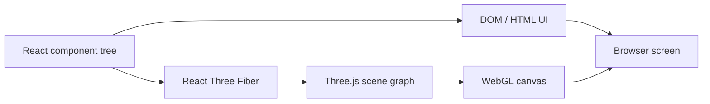
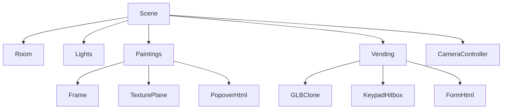
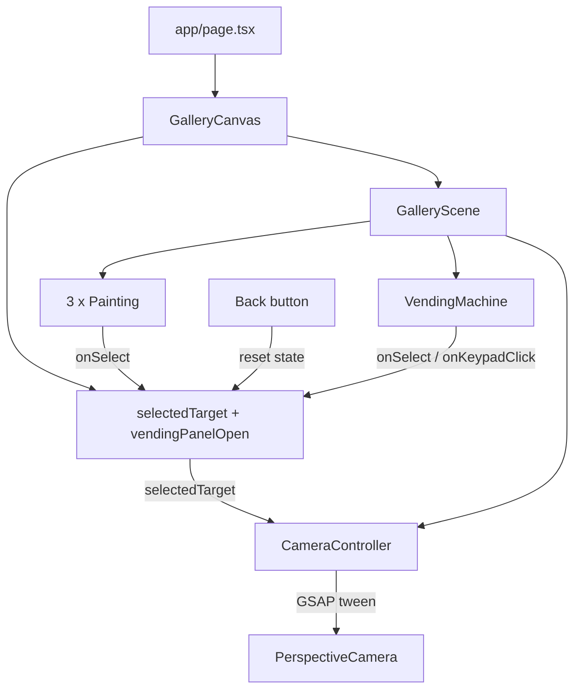
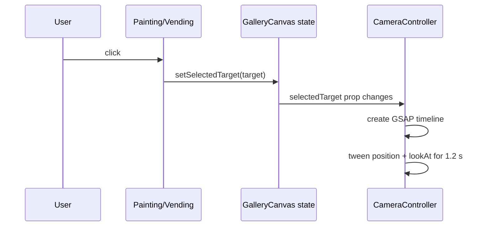
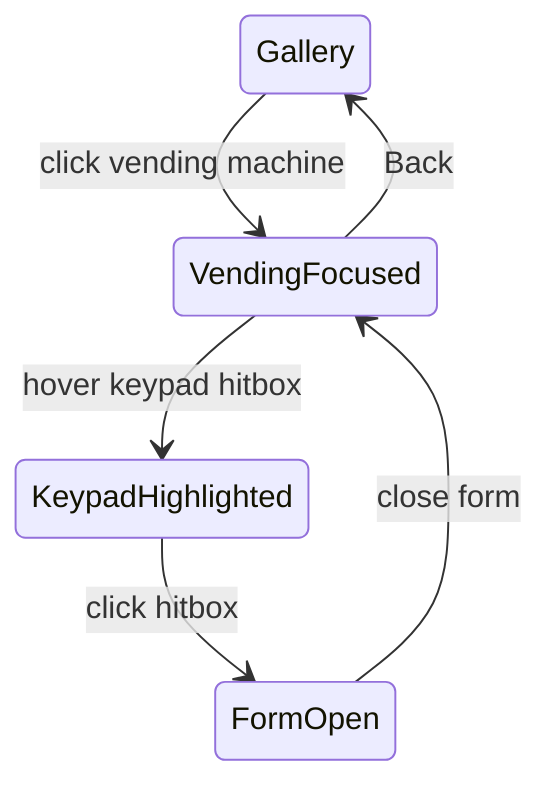
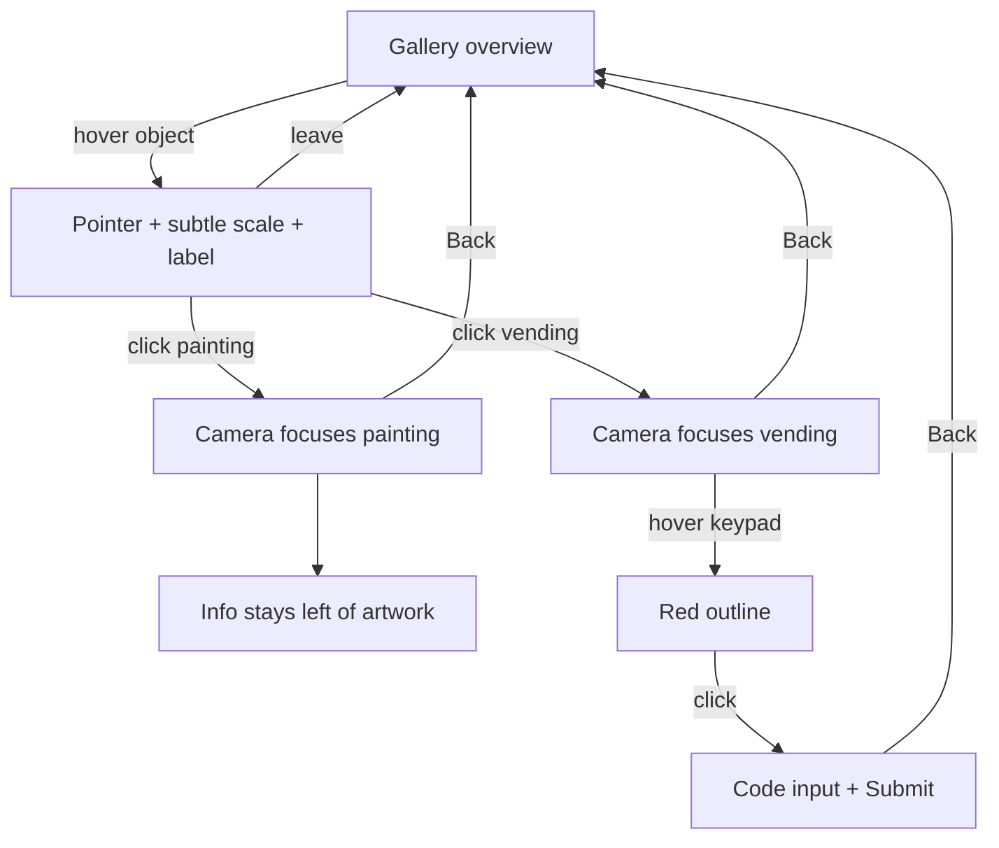

# Membangun Galeri Seni 3D Interaktif

Panduan langkah demi langkah - Next.js, TypeScript, React Three Fiber, Drei, Three.js, dan GSAP

Versi dokumentasi: 1.0  
Kondisi proyek: implementasi galeri per 8 September 2026

---

## 1. Tujuan pembelajaran

Dokumen ini membedah proyek `interactive-gallery` yang sedang berjalan, bukan contoh terpisah. Setelah membacanya, Anda diharapkan memahami:

- perbedaan DOM React biasa dan scene graph Three.js;
- fungsi scene, camera, renderer, geometry, material, mesh, texture, dan light;
- cara React Three Fiber menerjemahkan JSX menjadi objek Three.js;
- cara menyusun ruangan 3D dengan sistem koordinat;
- cara membuat komponen lukisan yang reusable dan data-driven;
- cara mengelola selection, hover, pointer event, dan HTML overlay;
- cara menganimasikan kamera dengan GSAP;
- cara memuat model GLB dan menambahkan invisible hitbox;
- penyebab z-fighting, posisi hitbox meleset, dan masalah UI 3D umum lainnya;
- arah pengembangan yang aman untuk tahap berikutnya.

> Catatan: koordinat dan ukuran di proyek ini adalah unit dunia Three.js. Kita memperlakukannya seperti meter agar mudah bernalar, tetapi Three.js sendiri tidak memaksakan satuan fisik tertentu.

## 2. Stack dan peran tiap teknologi

| Teknologi | Peran di proyek |
|---|---|
| Next.js App Router | Shell aplikasi, metadata, routing, bundling, dan serving asset publik |
| React + TypeScript | Komposisi komponen, state UI, props, serta pemeriksaan tipe |
| Three.js | Mesin 3D: vector, camera, mesh, material, light, texture, dan scene graph |
| React Three Fiber (R3F) | Renderer React untuk Three.js; menulis scene memakai JSX |
| Drei | Helper R3F seperti `Html`, `useTexture`, `useGLTF`, `Clone`, dan `Edges` |
| GSAP | Tween posisi dan arah pandang kamera secara sinematik |
| CSS | UI DOM: tombol Back, popover, form vending machine, dan aksesibilitas visual |

Versi penting saat dokumen dibuat:

```text
Next.js              16.3.4
React                19.2.8
Three.js             0.185.1
@react-three/fiber   9.7.0
@react-three/drei    10.7.8
GSAP                 3.15.0
```

## 3. Menjalankan proyek

```bash
cd interactive-gallery
yarn install
yarn dev
```

Buka `http://localhost:3000`. Untuk validasi statis:

```bash
yarn lint
yarn tsc --noEmit
```

Jika script `tsc` belum ada di `package.json`, jalankan `yarn tsc --noEmit` langsung seperti di atas.

## 4. Struktur proyek

```text
interactive-gallery/
├── app/
│   ├── page.tsx                 # entry halaman
│   ├── layout.tsx               # root HTML dan metadata
│   └── globals.css              # UI DOM dan layout layar penuh
├── components/gallery/
│   ├── GalleryCanvas.tsx        # client boundary, Canvas, state utama
│   ├── GalleryScene.tsx         # room, light, data objek, komposisi scene
│   ├── Painting.tsx             # lukisan reusable dan popover
│   ├── CameraController.tsx     # animasi kamera GSAP
│   └── VendingMachine.tsx       # GLB, hover, hitbox, dan form
├── public/
│   ├── paintings/               # texture lukisan JPG
│   └── model/                   # soda_vending_machine.glb
├── docs/                        # dokumentasi sumber Markdown
└── output/pdf/                  # dokumentasi PDF final
```

Prinsip modularitasnya: halaman tidak mengetahui detail Three.js, Canvas tidak menggambar ruangan, scene tidak mengurus animasi tween, dan tiap objek interaktif mengelola perilaku lokalnya sendiri.

## 5. Mental model: DOM dan dunia 3D

Aplikasi ini mempunyai dua lapisan visual:



- Tombol Back dan link kredit adalah DOM biasa di atas `<canvas>`.
- Dinding, lampu, lukisan, kamera, dan vending machine adalah objek dalam scene 3D.
- `<Html>` dari Drei menjembatani keduanya: posisinya mengikuti titik 3D, tetapi isi akhirnya adalah DOM sehingga input dan tombol tetap mudah digunakan.

Scene graph bersifat hierarkis:



Transform parent memengaruhi child. Jika sebuah `<group>` diputar, posisi lokal mesh dan hitbox di dalamnya ikut berputar. Konsep ini penting ketika mengatur lukisan di dinding samping dan hitbox keypad.

## 6. Fundamental koordinat 3D

Three.js menggunakan sistem koordinat tangan kanan:

```text
             +Y (atas)
              |
              |
              o------ +X (kanan)
             /
            /
          +Z (ke arah kamera awal)

Dinding belakang berada di Z negatif.
Kamera awal berada di Z positif dan melihat ke Z negatif.
```

Tuple `[x, y, z]` dipakai untuk `position`, sedangkan `rotation` memakai radian `[x, y, z]`.

```tsx
position={[0, 2.45, -4.86]}
rotation={[0, Math.PI / 2, 0]}
```

- `Math.PI / 2` = 90 derajat.
- `-Math.PI / 2` = -90 derajat.
- Posisi child adalah posisi lokal terhadap parent.
- Setelah parent berotasi, sumbu lokal child tidak selalu searah sumbu dunia.

## 7. Alur arsitektur aplikasi



Satu sumber kebenaran selection berada di `GalleryCanvas`. Painting dan vending machine tidak menentukan kamera secara langsung; keduanya hanya mengirim target yang dipilih. `CameraController` bereaksi terhadap perubahan target tersebut.

## 8. Langkah 1 - App Router shell

### `app/layout.tsx`

File ini membuat root HTML, memuat CSS global, dan mendefinisikan metadata.

```tsx
export const metadata: Metadata = {
  title: "Ruang Imaji | Galeri 3D",
  description: "Pengalaman galeri lukisan 3D interaktif.",
};
```

`<html lang="id">` membantu browser dan pembaca layar mengenali bahasa utama. `children` adalah halaman aktif yang disisipkan Next.js.

### `app/page.tsx`

```tsx
export default function Home() {
  return (
    <main className="gallery-page" aria-label="Galeri seni virtual">
      <GalleryCanvas />
    </main>
  );
}
```

Halaman tetap sederhana. Ia hanya menyediakan landmark `<main>` dan menyerahkan implementasi 3D kepada komponen gallery.

## 9. Langkah 2 - Client boundary dan Canvas

`GalleryCanvas.tsx` diawali dengan:

```tsx
"use client";
```

Ini wajib karena komponen memakai state React, event browser, dan WebGL. Komponen server tidak dapat langsung memakai API tersebut.

Konfigurasi Canvas:

```tsx
<Canvas
  camera={{ position: [0, 2.4, 6.5], fov: 58, near: 0.1, far: 50 }}
  dpr={[1, 1.75]}
  frameloop="demand"
  gl={{ antialias: true, powerPreference: "high-performance" }}
  shadows="percentage"
>
```

Penjelasan setiap opsi:

- `position`: titik awal PerspectiveCamera.
- `fov`: field of view vertikal; lebih kecil terasa lebih zoom, lebih besar terasa wide-angle.
- `near` dan `far`: jarak clipping camera. Objek di luar rentang tidak dirender.
- `dpr={[1, 1.75]}`: membatasi pixel ratio agar layar retina tidak terlalu mahal.
- `frameloop="demand"`: render hanya saat ada perubahan, hemat GPU untuk scene statis.
- `antialias`: menghaluskan tepi geometri.
- `powerPreference`: meminta GPU performa tinggi bila tersedia.
- `shadows="percentage"`: tipe shadow yang kompatibel dengan versi Three.js saat ini.

`<Suspense fallback={null}>` menunggu texture dan GLB selesai dimuat tanpa merender scene yang belum siap.

## 10. Langkah 3 - State selection

State pusatnya:

```tsx
const [selectedTarget, setSelectedTarget] =
  useState<GalleryFocusTarget | null>(null);
const [vendingPanelOpen, setVendingPanelOpen] = useState(false);
```

`null` berarti camera berada pada tampilan galeri. Sebuah target mempunyai kontrak:

```tsx
type GalleryFocusTarget = {
  id: string;
  title: string;
  position: readonly [number, number, number];
  cameraTarget: readonly [number, number, number];
};
```

`position` adalah titik yang dipandang camera. `cameraTarget` adalah tujuan posisi camera, bukan arah pandang. Nama ini dapat diperjelas menjadi `cameraPosition` pada refactor mendatang.

Tombol Back muncul secara kondisional ketika ada selection. `handleBack()` mereset selection dan panel vending secara bersamaan, sehingga CameraController otomatis kembali ke home.

## 11. Langkah 4 - Membuat ruangan galeri

Ukuran ruangan disimpan dalam satu konstanta:

```tsx
const ROOM = {
  width: 12,
  height: 6,
  depth: 10,
  wallThickness: 0.2,
} as const;
```

Setiap bidang dibuat dari pasangan geometry dan material:

```tsx
<mesh receiveShadow position={[0, -0.1, 0]}>
  <boxGeometry args={[ROOM.width, ROOM.wallThickness, ROOM.depth]} />
  <meshStandardMaterial color="#302a24" roughness={0.8} />
</mesh>
```

Dalam Three.js:

```text
Mesh = Geometry + Material + Transform
```

- Geometry mendefinisikan bentuk.
- Material mendefinisikan bagaimana permukaan bereaksi terhadap cahaya.
- Transform adalah position, rotation, dan scale.
- `receiveShadow` membuat permukaan menerima bayangan.

Floor berada sedikit di bawah `y=0`. Back wall berada di `z=-depth/2`. Side wall berada di `x=±width/2`.

## 12. Langkah 5 - Pencahayaan

Scene menggunakan ambient light dan empat spotlight.

```tsx
<ambientLight color="#fff4df" intensity={0.42} />
```

Ambient light memberi penerangan dasar merata agar area gelap tidak menjadi hitam total. Spotlight memberi arah, fokus, dan suasana galeri.

Spotlight Three.js membutuhkan `Object3D` sebagai target, bukan tuple biasa:

```tsx
const targetObject = useMemo(() => {
  const object = new Object3D();
  object.position.set(...target);
  return object;
}, [target]);
```

`useMemo` menjaga identitas target tetap stabil antar-render. `<primitive object={targetObject} />` memasukkan objek Three.js mentah ke scene graph R3F.

Properti penting spotlight:

- `intensity`: kekuatan cahaya;
- `distance`: jangkauan maksimal;
- `angle`: lebar cone dalam radian;
- `penumbra`: kelembutan tepi cone;
- `decay`: penurunan energi berdasarkan jarak;
- `shadow-mapSize`: resolusi texture bayangan;
- `shadow-bias` dan `shadow-normalBias`: mengurangi shadow acne.

## 13. Langkah 6 - Data-driven paintings

Alih-alih menulis tiga komponen berbeda, semua metadata diletakkan dalam array `paintings`.

```tsx
type GalleryPainting = GalleryFocusTarget & {
  src: string;
  description: string;
  price: number;
  rotation: Vector3Tuple;
  size: readonly [number, number];
};
```

Lalu dirender dengan map:

```tsx
{paintings.map((painting) => (
  <Painting
    key={painting.id}
    {...painting}
    selected={selectedTarget?.id === painting.id}
    onSelect={() => onSelectTarget(painting)}
  />
))}
```

Keuntungan pola ini:

- menambah lukisan cukup menambah data;
- bentuk dan interaksi tetap konsisten;
- TypeScript memastikan setiap entri lengkap;
- camera target menjadi milik masing-masing objek.

Penempatan saat ini:

| Lukisan | Dinding | Rotation Y | Camera sekitar 3 m di depan |
|---|---|---:|---|
| Danau Fajar | kiri | `Math.PI / 2` | `[-2.86, 2.45, -2.2]` |
| Champions 1999 | belakang | `0` | `[0, 2.45, -1.86]` |
| Kota Bulan Sabit | kanan | `-Math.PI / 2` | `[2.86, 2.45, -2.2]` |

## 14. Langkah 7 - Komponen Painting

### Memuat texture

```tsx
const texture = useTexture(src);
```

`useTexture` memuat JPG menjadi `THREE.Texture` dan terintegrasi dengan Suspense. Preload di akhir file memulai pemuatan lebih awal.

### Frame dan image plane

Frame memakai box tipis; gambar memakai plane di depannya:

```tsx
<boxGeometry args={[width + 0.12, height + 0.12, 0.04]} />
<planeGeometry args={[width, height]} />
```

Plane diletakkan pada `z=0.035`, sedikit di depan frame. Jarak kecil ini penting. Jika dua permukaan hampir coplanar, depth buffer bingung menentukan mana yang di depan dan muncul kedipan bernama **z-fighting**.

`meshStandardMaterial` bereaksi terhadap light. `roughness` besar menghasilkan pantulan yang lebih lembut. Saat selected, frame memperoleh sedikit emissive agar state fokus terlihat.

### Hover yang halus

`useFrame` berjalan pada frame render aktif:

```tsx
const targetScale = hovered && !selected ? 1.035 : 1;
const nextScale = MathUtils.damp(
  artworkRef.current.scale.x,
  targetScale,
  12,
  delta,
);
```

`MathUtils.damp` membuat transisi frame-rate independent. `delta` adalah waktu sejak frame sebelumnya. Scale hover dinonaktifkan ketika selected agar tidak terjadi zoom tambahan saat camera sudah dekat.

Karena Canvas menggunakan render on demand, `invalidate()` dipanggil selama nilai belum mencapai target.

### Pointer event

```tsx
event.stopPropagation();
setHovered(active);
document.body.style.cursor = active ? "pointer" : "default";
```

R3F melakukan raycasting dari pointer ke object 3D. `stopPropagation()` mencegah event melanjutkan ke mesh di belakangnya.

### Popover

Ada dua mode:

- belum selected: muncul saat hover di atas lukisan;
- selected: selalu muncul di sebelah kiri lukisan.

`<Html>` memproyeksikan anchor 3D ke posisi DOM. `distanceFactor` mengontrol hubungan jarak 3D dengan skala HTML. Popover selected memakai anchor tepi kiri lokal agar panel tidak menutupi gambar.

## 15. Langkah 8 - CameraController dan GSAP

Alur saat selection berubah:



Camera memiliki dua hal yang dianimasikan bersamaan:

1. `camera.position` menuju `cameraTarget` milik object;
2. vector `lookAt` menuju pusat object.

```tsx
timeline
  .to(camera.position, { x, y, z }, 0)
  .to(lookAt, { x, y, z }, 0);
```

Argumen posisi `0` membuat kedua tween mulai pada waktu yang sama. Ease `power2.inOut` mempercepat dengan lembut di awal lalu memperlambat menjelang tujuan.

Pada setiap update:

```tsx
camera.lookAt(lookAt);
camera.updateProjectionMatrix();
invalidate();
```

Cleanup `timeline.kill()` mencegah tween lama terus berjalan bila pengguna memilih objek lain dengan cepat.

Saat selection `null`, destination berubah menjadi `HOME_POSITION` dan focus menjadi `HOME_LOOK_AT`; mekanisme yang sama membawa camera kembali.

## 16. Langkah 9 - Memuat GLB vending machine

GLB adalah container biner glTF. Satu file dapat membawa hierarchy mesh, material PBR, texture, camera, animation, dan metadata.

```tsx
const { scene } = useGLTF(MODEL_PATH);
<Clone object={scene} castShadow receiveShadow />
```

Mengapa memakai `Clone`? Object Three.js sebaiknya tidak dipasang sebagai child di lebih dari satu parent. Clone membuat instance aman jika model kelak digunakan berkali-kali.

```tsx
<group
  position={[...position]}
  rotation={[0, Math.PI + Math.PI / 5, 0]}
  scale={MODEL_SCALE}
>
```

Group menjadi transform root. Model, label, hitbox, dan form semuanya memakai ruang lokal yang sama. Material dan texture sudah tertanam dalam GLB; lighting scene tetap menentukan seberapa jelas desainnya terlihat.

Model saat ini berasal dari RasenDan di Sketchfab dan menggunakan lisensi CC BY 4.0. Karena itu link kredit ditampilkan permanen di UI.

## 17. Langkah 10 - Invisible keypad hitbox

Model tidak harus dipecah untuk interaksi sederhana. Kita dapat meletakkan mesh transparan di depan area tombol:

```tsx
const KEYPAD_HITBOX = {
  position: [-0.35, 0.26, -0.47],
  size: [0.17, 0.27, 0.005],
} as const;
```

```tsx
<mesh position={[...KEYPAD_HITBOX.position]} onClick={handleKeypadClick}>
  <boxGeometry args={[...KEYPAD_HITBOX.size]} />
  <meshBasicMaterial
    transparent
    opacity={0}
    depthWrite={false}
    colorWrite={false}
  />
  {keypadHovered && <Edges color="#ff3b30" lineWidth={2.5} />}
</mesh>
```

Walau tidak berwarna, geometry tetap berpartisipasi dalam raycast. `colorWrite={false}` mencegah permukaan menulis warna dan `depthWrite={false}` mencegahnya menghalangi object lain di depth buffer.

Hitbox hanya dirender ketika vending machine selected. Ini membuat alurnya dua tahap:



`Edges` terlihat hanya pada hover sehingga pengguna memperoleh affordance area klik. `console.info` pada handler membantu debugging nama object, world point, dan UV hasil raycast.

### Mengapa posisi hitbox sempat meleset?

Angka hitbox berada dalam koordinat lokal group GLB. Group itu dirotasi dan diskalakan. Akibatnya, “geser kiri” di layar tidak selalu berarti mengurangi nilai X lokal. Cara debugging yang aman:

1. tampilkan sementara material dengan opacity 0.2;
2. gunakan warna terang dan `Edges`;
3. ubah satu sumbu saja dalam langkah kecil;
4. periksa dari camera fokus, bukan hanya camera awal;
5. setelah tepat, kembalikan opacity ke 0.

Jika setiap tombol perlu aksi unik, ada dua pilihan:

- buat beberapa hitbox kecil dengan kode `A`, `1`, `2`, dan seterusnya;
- beri nama mesh tombol di Blender lalu cari node berdasarkan `name` dari hasil `useGLTF`.

Model tidak wajib dipecah menjadi banyak file. Penamaan node yang baik di dalam satu GLB biasanya sudah cukup.

## 18. Langkah 11 - Form HTML di dalam scene

Form vending machine dirender melalui Drei `<Html>`:

```tsx
<Html
  center
  position={[0, 0.13, -0.78]}
  distanceFactor={4}
  zIndexRange={[100, 0]}
  style={{ pointerEvents: "auto" }}
>
```

`pointerEvents: "auto"` penting karena popover informasional memakai `none`, tetapi form harus menerima input. Event form dihentikan agar klik tombol tidak diteruskan ke group 3D di belakangnya.

`handleSubmit`:

1. mencegah reload browser;
2. memangkas spasi;
3. mengubah kode menjadi uppercase;
4. menampilkan pesan sukses lokal.

Saat ini submit adalah simulasi UI, belum menghubungi backend atau mengeluarkan produk virtual.

## 19. Langkah 12 - CSS overlay

`globals.css` menangani tiga kategori:

1. reset dan full-screen layout;
2. UI global seperti Back dan model credit;
3. elemen dari Drei `<Html>` seperti painting popover dan vending form.

Pola visual utama memakai warna gelap semi-transparan:

```css
background: rgb(17 15 13 / 30%);
backdrop-filter: blur(16px);
```

Perbedaannya:

- alpha pada background membuat panel tembus pandang;
- backdrop filter mengaburkan scene di belakang panel;
- box shadow memisahkan panel dari gambar;
- `z-index` mengatur urutan DOM, bukan urutan mesh WebGL.

Media query `prefers-reduced-motion` menonaktifkan animasi bagi pengguna yang memilih pengurangan gerak pada sistem operasi.

## 20. Alur interaksi lengkap



## 21. Penjelasan per file

### `app/page.tsx`

- Entry route `/`.
- Menyediakan semantic `<main>`.
- Tidak menyimpan state atau detail WebGL.

### `app/layout.tsx`

- Root document App Router.
- Memuat `globals.css`.
- Menetapkan metadata dan bahasa dokumen.

### `app/globals.css`

- Mengunci aplikasi ke viewport penuh.
- Menata DOM overlay.
- Menyediakan hover/focus state dan reduced motion.
- Tidak mengatur material atau geometry Three.js.

### `GalleryCanvas.tsx`

- Client boundary utama.
- Membuat WebGL Canvas dan camera awal.
- Menjadi owner state selection dan vending panel.
- Menampilkan tombol Back serta atribusi model di luar canvas.

### `GalleryScene.tsx`

- Menyimpan data ruangan, painting, vending target, dan lighting.
- Menyusun semua object 3D.
- Meneruskan callback, bukan menyimpan selection sendiri.
- Menjadi composition root dunia 3D.

### `Painting.tsx`

- Memuat texture.
- Membuat frame dan bidang gambar.
- Mengelola hover lokal.
- Mengirim selection ke parent.
- Merender popover hover dan selected.

### `CameraController.tsx`

- Tidak merender geometry (`return null`).
- Mendengarkan perubahan `selectedTarget`.
- Menganimasikan posisi camera dan look-at vector.
- Membersihkan timeline lama.

### `VendingMachine.tsx`

- Memuat dan clone GLB.
- Mengelola hover model dan hitbox.
- Menampilkan label sederhana.
- Menambahkan invisible hitbox tanpa memodifikasi GLB.
- Menampilkan form DOM yang terikat ke titik 3D.

## 22. Masalah umum dan diagnosis

### Texture hitam atau tidak tampil

- Pastikan path dimulai dari root: `/paintings/painting-1.jpg`.
- File harus berada di `public/paintings`.
- Periksa tab Network untuk status 404.
- Pastikan ada light jika memakai `meshStandardMaterial`.
- Coba `meshBasicMaterial` sementara untuk membedakan masalah texture dan lighting.

### Frame berkedip

Penyebab utama adalah z-fighting. Jauhkan texture plane sedikit dari backing atau gunakan geometry frame yang benar-benar memiliki lubang. Jangan menumpuk dua bidang coplanar.

### Model GLB tampak gelap/polos

- Pastikan texture benar-benar embedded atau file `.bin` dan image pendamping ikut tersedia.
- Tambah light yang diarahkan ke model.
- Periksa color space texture dan material.
- Jangan mengganti material GLB secara tidak sengaja.

### Click tidak masuk ke hitbox

- Pastikan geometry hitbox berada di depan permukaan model.
- Pastikan `selected` benar sehingga hitbox dirender.
- Periksa object lain yang menangkap ray lebih dulu.
- Gunakan `Edges` dan opacity sementara untuk kalibrasi.
- Log `event.object.name` dan `event.point`.

### UI `<Html>` terpotong

- Jangan meletakkan anchor terlalu dekat tepi viewport.
- Gunakan posisi berbeda antara mode overview dan focus.
- Sesuaikan `distanceFactor`.
- Untuk UI penting yang harus selalu terlihat, pertimbangkan overlay DOM fixed di luar Canvas.

### Dev server terus reconnect

- Hindari menjalankan `next build` pada folder `.next` yang sama saat `next dev` aktif.
- Hentikan proses lama dan jalankan ulang `yarn dev`.
- Periksa error kompilasi pertama di terminal, bukan hanya pesan reconnect browser.

## 23. Performa dan kualitas produksi

Yang sudah diterapkan:

- `frameloop="demand"` untuk scene dominan statis;
- batas DPR untuk mengendalikan biaya pixel;
- preload texture dan GLB;
- cleanup GSAP timeline;
- komponen dan data terpisah;
- reduced motion;
- type-safe tuple dan target contract.

Peningkatan berikutnya:

- kompres texture ke WebP/AVIF atau KTX2;
- kompres geometry GLB dengan Draco/Meshopt;
- gunakan environment map yang terkontrol;
- tambahkan loading progress dan error boundary;
- uji keyboard navigation dan mobile layout;
- pisahkan data artwork ke JSON atau CMS;
- sediakan fallback bila WebGL tidak tersedia;
- audit lisensi seluruh asset.

## 24. Cara menambah lukisan baru

1. Simpan image di `public/paintings`.
2. Tambahkan item ke array `paintings`.
3. Tentukan `position` dan `rotation` berdasarkan dinding.
4. Tentukan posisi camera sekitar 2-3 unit di depan bidang.
5. Tambahkan preload bila diperlukan.
6. Uji overview, hover, focus, popover, dan Back.

Contoh:

```tsx
{
  id: "new-artwork",
  src: "/paintings/new-artwork.jpg",
  title: "Judul Baru",
  description: "Deskripsi singkat.",
  price: 12_000_000,
  position: [0, 2.45, -4.86],
  rotation: [0, 0, 0],
  size: [1.8, 2.4],
  cameraTarget: [0, 2.45, -1.86],
}
```

## 25. Cara membuat tombol vending individual

Untuk input langsung dari keypad, ubah satu hitbox besar menjadi grid hitbox kecil:

```tsx
const KEYS = [
  { label: "A", position: [-0.04, 0.10, 0] },
  { label: "1", position: [0.00, 0.10, 0] },
  { label: "2", position: [0.04, 0.10, 0] },
];
```

Render setiap key relatif terhadap sebuah `<group position={KEYPAD_ORIGIN}>`. Klik menambahkan karakter ke state `code`. Keuntungan origin group adalah seluruh keypad dapat digeser tanpa menghitung ulang setiap tombol.

Untuk presisi lebih tinggi:

1. buka GLB di Blender;
2. beri nama mesh tombol, misalnya `Key_A`, `Key_1`;
3. export sebagai satu GLB;
4. akses node hasil `useGLTF` berdasarkan nama;
5. pasang handler atau hitbox pada node terkait.

## 26. Latihan belajar

1. Tambahkan ceiling tanpa menutup sudut pandang camera.
2. Tambahkan satu sculpture GLB di tengah ruangan.
3. Buat highlight spotlight berubah ketika selection berubah.
4. Buat keypad mengisi input tanpa keyboard.
5. Tambahkan validasi kode berdasarkan daftar produk.
6. Buat camera path dua tahap: mendekat lalu framing.
7. Tambahkan loading screen dengan `useProgress` dari Drei.
8. Pindahkan metadata lukisan ke file JSON.

## 27. Glosarium ringkas

| Istilah | Arti |
|---|---|
| Scene | Root container dunia 3D |
| Scene graph | Hierarki parent-child seluruh object 3D |
| Camera | Sudut pandang yang memproyeksikan dunia ke layar |
| Renderer | Sistem yang menggambar scene dari camera ke canvas |
| Geometry | Bentuk dan vertex sebuah object |
| Material | Cara permukaan merespons cahaya dan warna |
| Mesh | Gabungan geometry dan material |
| Texture | Image/data yang dipetakan ke permukaan |
| UV | Koordinat 2D pada permukaan geometry untuk texture |
| Raycasting | Menembakkan ray dari pointer untuk mencari object yang terkena |
| GLB/glTF | Format pertukaran scene dan asset 3D |
| PBR | Model material berbasis sifat fisik |
| Z-fighting | Kedipan akibat dua permukaan berebut depth yang sama |
| Local space | Koordinat relatif terhadap parent |
| World space | Koordinat final terhadap root scene |
| Tween | Interpolasi nilai dari awal ke tujuan selama durasi tertentu |
| Invalidate | Meminta R3F merender frame baru pada demand mode |

## 28. Ringkasan mental model

Jika Anda memahami alur berikut, Anda sudah memegang fondasi utama proyek ini. Tahap berikutnya bukan sekadar menambah fitur, tetapi memperkuat data model, accessibility, asset pipeline, dan pengujian interaksi.

```text
Data object menentukan posisi dan camera destination.
        ↓
GalleryScene membangun scene graph.
        ↓
R3F menerjemahkan JSX menjadi object Three.js.
        ↓
Pointer diraycast ke mesh dan hitbox.
        ↓
Selection disimpan di GalleryCanvas.
        ↓
CameraController tween camera dengan GSAP.
        ↓
Drei Html menempelkan UI DOM ke titik 3D.
```
